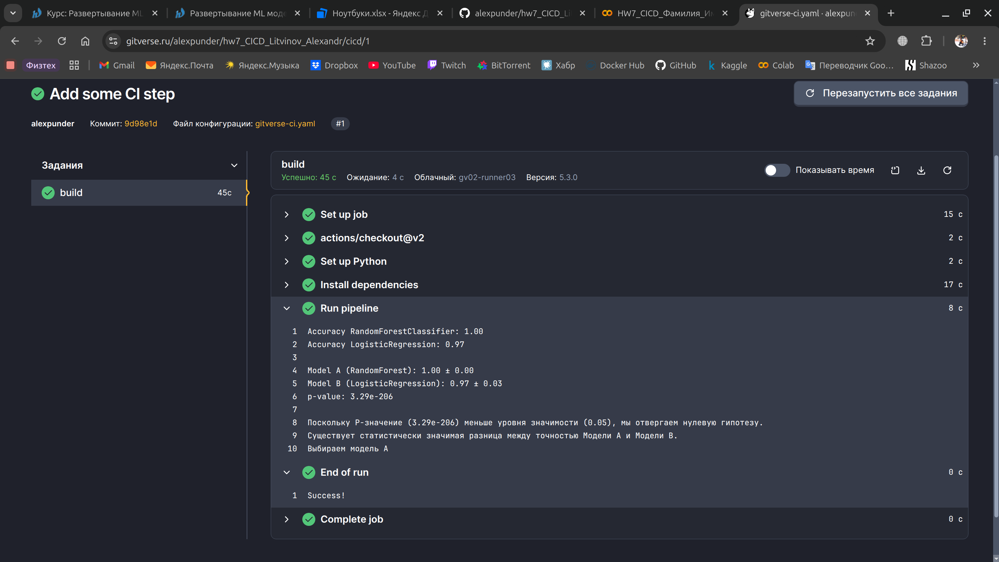
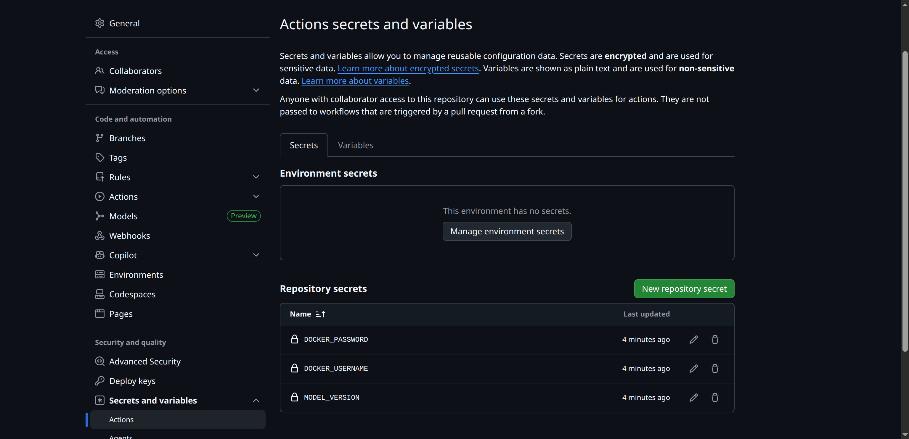
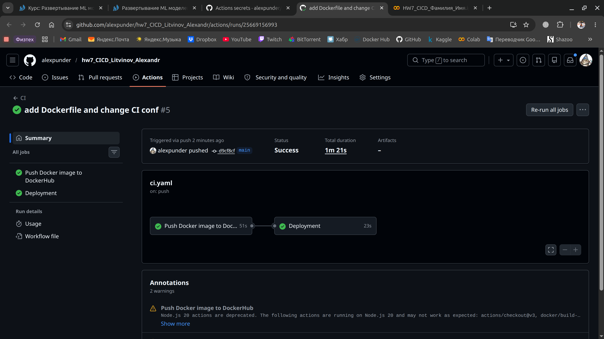
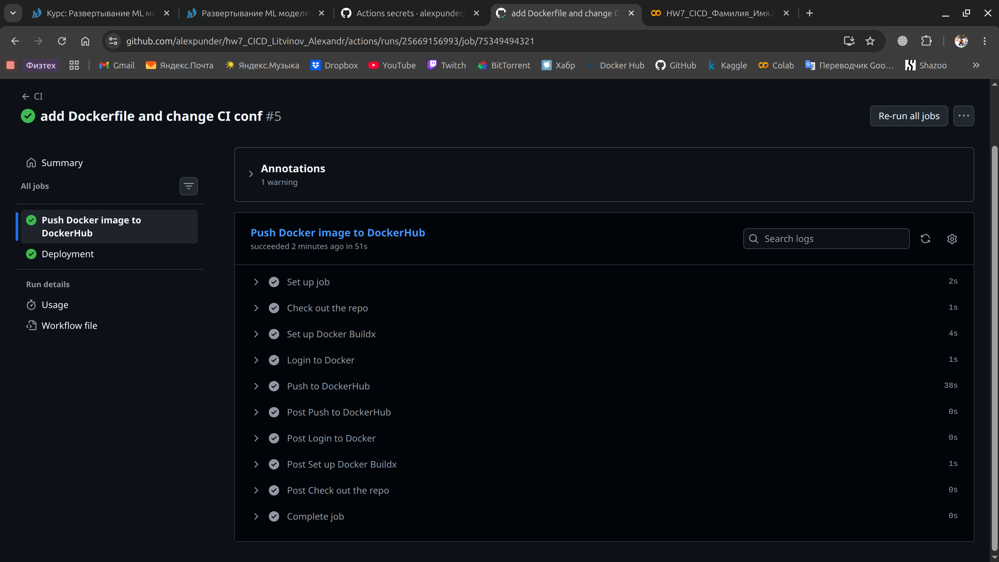
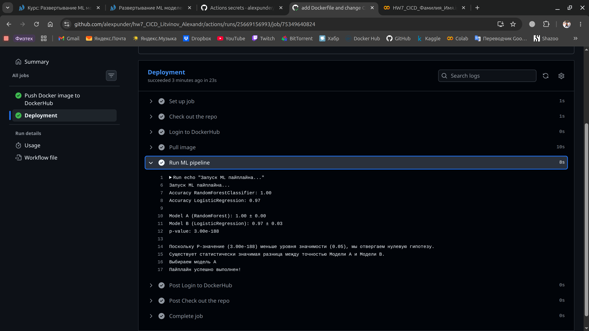

# Домашнее задание 7. Сборка конвейера CI/CD

### 1. Настроить CI/CD-пайплайн для ML-сервиса с использованием GitLab

Так как регистрация нового профиля в `GitLab` из России недоступна, было разрешено выполнить задание в `GitVerse`. Однако, в последнем используется синтаксис `GitHub Actions`, поэтому их `workflow` одинаковые.

[Ссылка на успешный Pipeline](https://gitverse.ru/alexpunder/hw7_CICD_Litvinov_Alexandr/cicd)



### 2. Обосновать стратегию деплоя (развертывания, Blue-Green, Canary, Rolling, Shadow) и оценить влияние на риски

Для описания стратегии был использован [`adr-tool`](https://github.com/npryce/adr-tools):  
```
sudo apt install adr-tool
adr init doc/architecture/decisions
adr new "Explain deploy strategy"
```

[Итоговый артефакт задания](doc/architecture/decisions/0002-explain-deploy-strategy.md)

### 3. Реализовать стратегию развертывания

Стратегия реализуется следующими действиями:
- Поднимается два идентичных контейнера приложения для Blue и Green соответственно; [простой docker compose для сервисов](docker-compose.yaml)
- Балансировщик распределяет трафик в заданных пропорциях: 90% на Blue, 10% на Green (Canary);
  * [пример из документации](https://nginx.org/en/docs/http/ngx_http_split_clients_module.html)
  * [реализация в файле конфигураций](nginx.conf)
- Если мы понимаем, что необходимо полностью вернуть предыдущую модель, то происходит мгновенный откат: меняем 90% на 100% в `split_clients`, перезапускаем `Nginx`, и весь трафик возвращается на Blue
- Если все в порядке, то выполняем полное переключение: меняем 10% `green` на 100%, и Green становится активным окружением

### 4. Спланировать A/B-тестирование для ML-модели

[Реализация A/B-тестирования двух моделей](ml_pipeline.py)

### 5. Создать CI/CD-пайплайн для ML-сервиса с использованием GitHub Actions

[Ссылка GitHub Actions](https://github.com/alexpunder/hw7_CICD_Litvinov_Alexandr/actions)









### Итоговые выводы

...
